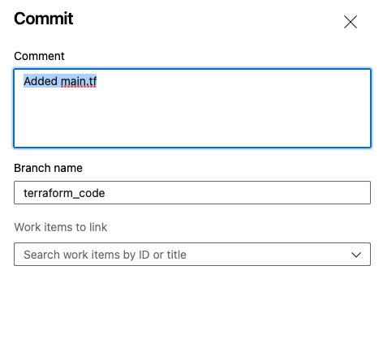
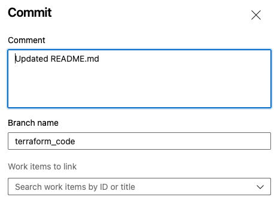

# tfc_azure_vcs_connection

This repository describes a step by step creation of the following

- Create a repository within Azure DevOps Services with Terraform code to execute
- Create a VCS connection from Terraform Cloud to Azure DevOps
- Create a workspace within Terraform Cloud  

This repository is based on the official HashiCorp documentation:  
[https://www.terraform.io/cloud-docs/vcs/azure-devops-services](https://www.terraform.io/cloud-docs/vcs/azure-devops-services)


# Prerequisites

- Access to Azure DevOps
- Access to Terraform Cloud

# How to

## Create a repository within Azure DevOps

- login to Azure DevOps
[https://dev.azure.com/](https://dev.azure.com/)
- create a new Project   
  
- Give it a name and make it public/private and click create    
  
- go to Repos -> files -> Initialize Main branch with a README     
  
- select new branch    
  
- fill in the details   
  
- create a new file called ```main.tf```  
  
- Add the following code and click commit
```
provider "random" {}

resource "random_pet" "pet1" {}

output "pet1" {
  value = random_pet.pet1.id
}
```
- commit  
  
- edit the ```README.md``` with the following and commit
```
# Repository tfc_example_azure

This repository is stored within Azure DevOps services

It is used for an example using a VCS provider within Terraform Cloud
```
- commit    
  
- Go to repos --> branches   
  
- create a new pull request  
    
  
- Complete the merge
  
  

## Check Azure DevOps settings
- login to Azure DevOps
[https://dev.azure.com/](https://dev.azure.com/)
- go to your organization settings  
  
- Go to Policies and make sure the ```Third-party application access via OAuth``` is turned on as below   
  

## Create a VCS provider to Azure DevOps

### Terraform Cloud - Part 1
- Login to your Terraform Cloud organization
[Terraform Cloud](https://app.terraform.io/app)
- Go to Settings -> Version Control -> Providers
- Click on add a VCS provider  
  
- Select Azure DevOps Services  

- leave this page open
- Go to the next Chapter on Azure DevOps Services

### Azure DevOps Services
We are going to create an application with DevOps to use
- Go to the following page 
[DevOps](https://aex.dev.azure.com/app/register?mkt=en-US)
- Add the information you find on the Terraform Cloud page

| Field name                 | Value                                       |
| -------------------------- | ------------------------------------------- |
| Company name               | HashiCorp                                   |
| Application Name           | Terraform Cloud (YOUR ORGANIZATION NAME)    |
| Application website        | https://app.terraform.io                    |
| Authorization callback URL | https://app.terraform.io/YOUR CALLBACK URLV |

- Check the boxes for ```code (read)``` and ```Code (status)``` only  
  
- at the bottem create application  
  
- Copy the app secret and client secret to the Terraform Cloud location
  
- Go back to the Terraform Cloud page again

### Terraform Cloud - Part 2

- Insert a name for the connection
- Paste the App ID from the Azure page 
**NOTE the space that you perhaps copy/paste in the beginning**
- Client Secret  
  
- Accept the connection  
  
- Skip the SSH key pair   
  

## Create a workspace using the VCS provider and the DevOps repository

- Login to Terraform Cloud
